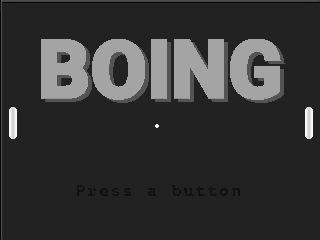

# Developing
This document's purpose is to provide a high-level understanding of how Boing works. Programmers wishing to get involved should review our [contribution](./md/CONTRIBUTING.md) guidelines as well as have a decent understanding of C++ and build tools. Having some knowledge of SOCs, such as the [ESP32-WROVER](https://docs.espressif.com/projects/esp-idf/en/latest/get-started/get-started-wrover-kit.html) would also be very helpful. 
Boing is a cross-platform a block-breaking game developed by [Modus Create](https://moduscreate.com) and its sole purpose is to demonstrate how to use [creative engine](https://github.com/moduscreateorg/creative-engine). Boing runs on the [ODROID GO](https://www.hardkernel.com/shop/odroid-go/), macOS and Linux.


## How to Play
Genus is a simple game where you have to outsmart your AI opponent and land the ball behind his paddle. 



#### All platforms
[Boing](https://github.com/moduscreateorg/boing) this game.\
[Creative Engine](https://github.com/ModusCreateOrg/creative-engine) is the game engine developed by Modus Create. It implements LibXMP, SDL2, ESP-IDF (Audio, Video and Input drivers).\
[LibXMP](http://xmp.sourceforge.net/) is a fantastic cross-platform library for playing music using the [Xtended Module (XM)](https://en.wikipedia.org/wiki/XM_(file_format)) format and also has additional functionality to play sound effects.\
 
[Rcomp](https://github.com/ModusCreateOrg/creative-engine/blob/master/tools/rcomp.cpp) is a CLI tool that takes any binary resources and packages  (graphic, audio, etc.) them into a binary blob to be included in the game executable and is part of [Creative Engine](https://github.com/ModusCreateOrg/creative-engine).

#### macOS, Linux
[SDL2](https://www.libsdl.org/download-2) is a cross-platform low-level media layer framework. Creative Engine generates audio data with LibXMP and feeds it into the SDL2 audio run loop and does similar to present visuals in the application window as well as poll for keyboard input to allow for game play.

#### ODROID GO
[Espressif IoT development Framework (ESP IDF)](https://github.com/espressif/esp-idf) is a low level framework for accessing capabilities of the ESP32-WOVER SOC.


## Getting started
Let's get setup for desktop and device development. To do so, we'll need to ensure that we have the right libraries and tools installed.

We're going to get setup in three phases:
1. Clone Boing and Creative Engine
2. Install supporting desktop libraries and tools
3. Install ESP IDF toolchain (this is only needed if you want to program an ODROID GO)

## Clone Boing and Creative Engine
The first thing we need to is create a folder that will contain Boing and Creative engine. When we're done, the folder struction will look similar to the following.

    projects/
       |-boing-game/
            |-creative-engine/      # Source Creative Engine
            |-boing/               # Source for Boing
                |-creative-engine/  # Symbolic Link to the above directory

Let's clone the Boing and Creative Engine repos:

    mkdir boing-game/                                          # Whould be within ~/projects or similar
    cd boing-game/
    git clone git@github.com:ModusCreateOrg/boing.git
    git clone git@github.com:ModusCreateOrg/creative-engine.git
    ln -s creative-engine/ boing/creative-engine               # Create Symbolic Link
   
## Install dependencies

### macOS
- [ ] Install [XCode](https://developer.apple.com/xcode/)
- [ ] Intall [Homebrew](https://brew.sh) 
    /usr/bin/ruby -e "$(curl -fsSL https://raw.githubusercontent.com/Homebrew/install/master/install)"
- [ ] Install final dependencies via HomeBrew
```    
# Run this command from boing/
brew install
```
- [ ] Build and run Boing
```    
# Run these commands command from boing/
mkdir build                    # Create build directory
cd build                       
cmake ..                       # Execute Cmake and prepare for build
make -j 4                      # Four threads. Change to whatever you wish for faster compilation
open boing.app                 # Run Boing
```

### Linux (Debian based)
- [ ] Install dependencies
```
sudo apt-get install libsdl2-dev libsdl2-image-dev cmake g++ -y
```
- [ ] Build Boing
```    
# Run this command from boing/
make resources                 # Generates src/Resources.bin binary file to be included in our program
mkdir build                    # Create build directory
cd build                       
cmake ..                       # Execute Cmake and prepare for build
make -j 4                      # Four threads. Change to whatever you wish for faster compilation
./boing
```
### Raspberry Pi

Genus is tested on Raspbian Stretch (9.6) on the Raspberry Pi 2B+ and 3B+. You will need about 2GB of space in /tmp and about 2GB of space in /home to build this.

The game will run very slowly without enabling the OpenGL desktop driver. You can enable it by running `sudo raspbi-config` and choosing _Advanced Options / GL Driver / GL (Full KMS)_. The game will run very slowly without enabling the OpenGL desktop driver. You can enable it by running `sudo raspbi-config` and choosing _Advanced Options / GL Driver / GL (Full KMS)_. See this site for complete instructions:  [https://eltechs.com/how-to-enable-opengl-on-raspberry-pi/](https://eltechs.com/how-to-enable-opengl-on-raspberry-pi/).


## ODROID GO/ESP32
- [ ] Follow the [setup-toolchain](https://docs.espressif.com/projects/esp-idf/en/stable/get-started/#setup-toolchain) instructions for the ESP IDF. Be sure to follow them thorougly! 
- [ ] Stage the appropriate SDK config file
```
# Linux ONLY
cp sdkconfig.linux sdkconfig
# macOS ONLY
cp sdkconfig.mac sdkconfig
```
- [ ] Build and run Boing 
```
# From within boing/
# *IF* you are prompted by the build system to say yes or no to any configura†ion changes, 
# choose the default (press ENTER).
make recoures
make -j 4 flash   #Assuming you have four CPU cores to compile
```

## Additional information
We highly recommend using the [CLion IDE](https://www.jetbrains.com/clion/) to develop the project and run the builds.


## Git Workflow
Read about [GitHub workflow](https://github.com/ModusCreateOrg/creative-engine) at the creative-engine repo.

The gist is that we fork the main repos and work in our private forks.  We push to our forks.  We create Pull Requests against the main repos.

The only way code makes it into master in the main repo is if we merge a PR.
